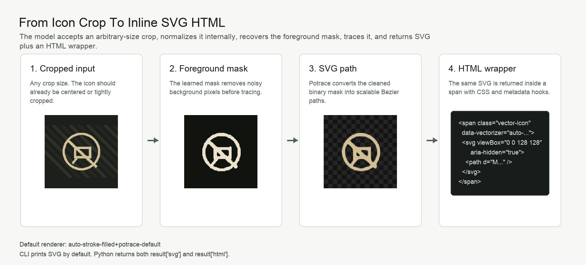
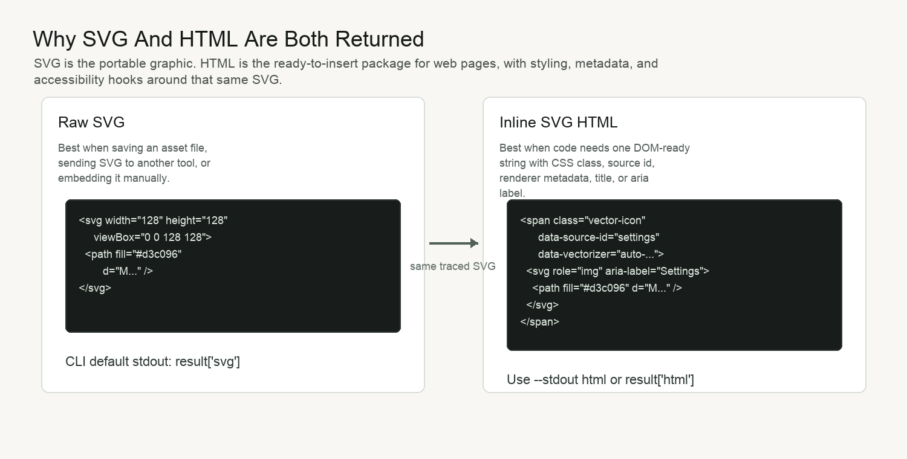
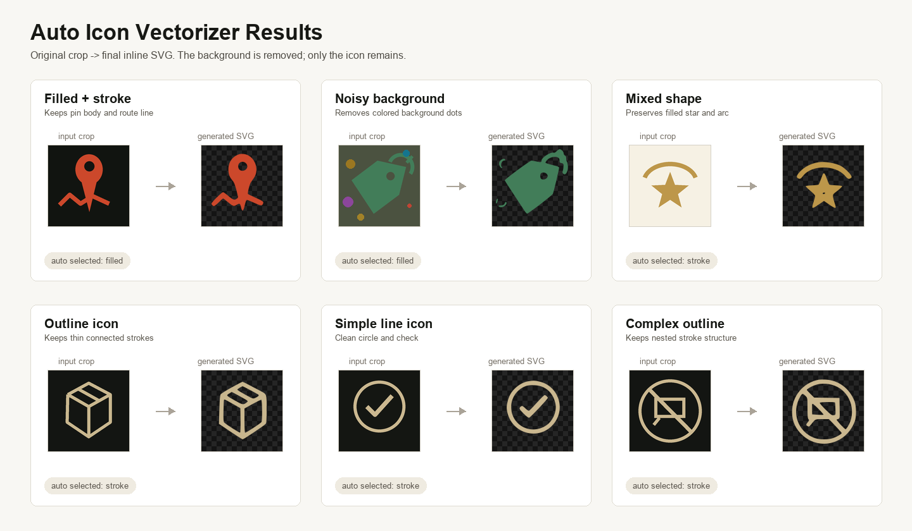

# Auto Icon Vectorizer - AI UI Icon Crop to SVG

Recover blurry AI-generated UI icon crops as clean SVG and inline SVG HTML.

Auto Icon Vectorizer is an image-to-SVG tool for small UI icons found inside
AI-generated interface images, screenshots, and mockups. It takes one cropped
raster icon, removes the background, traces the recovered foreground mask, and
returns both raw SVG and an HTML wrapper containing that same inline SVG.

## Why This Exists

This project is mainly for AI-generated UI images, screenshot-to-code
workflows, and blurry icon crops that do not have a clean source SVG.

Image models can generate UI mockups where the icons match the page's visual
style, color, lighting, and theme. The problem is that those icons usually only
exist as small blurry raster pixels inside the generated image. Replacing them
with a stock icon from a library can be cleaner, but it can also change the
look of the design. Asking an image model to redraw every icon is slower, more
expensive, less reproducible, and still leaves the page with raster image
assets.

Auto Icon Vectorizer takes the icon that already exists in the generated UI
image and turns it into a lightweight SVG. That gives the web page a scalable,
fast-loading asset while preserving more of the style that was present in the
original generated design.

If a clean source icon already exists, use that source icon. This tool is most
useful when the icon only exists as pixels in a generated image, screenshot, or
mockup and the goal is to recover a usable web asset from those pixels.

The problem it solves is narrower than general image vectorization. Existing
open source tools are already strong at tracing clean bitmaps, scans, logos,
pixel art, or full-color artwork:

| Project | What it is strong at | Where this tool is different |
| --- | --- | --- |
| [Potrace](https://github.com/skyrpex/potrace) | Smooth vector paths from a black/white bitmap | Potrace is used here only after the icon foreground mask has been recovered. |
| [AutoTrace](https://github.com/autotrace/autotrace) | Classic bitmap-to-vector conversion with outline/centerline tracing, despeckling, color reduction, and many output formats | This tool focuses on clean SVG plus optional inline HTML for small UI icons. |
| [VTracer](https://github.com/visioncortex/vtracer) | Color raster-to-vector conversion for scans, graphics, photos, and pixel art | This tool is tuned for tiny icon crops where background removal is usually harder than curve fitting. |
| [ImageTracerJS](https://github.com/jankovicsandras/imagetracerjs) | Browser/Node image-to-SVG tracing with palette and preprocessing options | This tool does not try to vectorize every color layer. It tries to isolate one icon first. |
| Recent research such as [SAMVG](https://arxiv.org/abs/2311.05276), [StarVector](https://arxiv.org/abs/2312.11556), and [AmodalSVG](https://arxiv.org/abs/2604.10940) | General image-to-SVG generation, segmentation-assisted vectorization, or editable semantic layers | This tool is a lightweight local pipeline for cropped UI icons, not a general SVG generation model. |

The niche is noisy UI icon crops, especially icons taken from screenshots,
mockups, or AI-generated interface images where the foreground icon may sit on a
dark, textured, colorful, or patterned background. In those cases, directly
running a tracer often copies background texture into the SVG. Auto Icon
Vectorizer treats mask recovery as the main problem, then uses Potrace for the
final vector path.



Use this project when:

- an app already has a small crop around an icon from an AI-generated UI image,
  screenshot, or mockup
- the goal is clean HTML/SVG that can be inserted into a web page
- the icon should be separated from a noisy or AI-generated background
- the icon is mostly one foreground color

Choose a different tool when:

- a clean SVG, font icon, or icon-library match already exists and style drift
  is acceptable
- the input is a full photo, illustration, scan, or complex logo
- the desired output is a fully editable SVG rebuilt from circles, lines,
  polygons, text, and named layers
- every foreground color in a multicolor logo must remain separate
- the task is to find icons inside a full screenshot

Assumptions:

- the input is already cropped around one icon
- the icon foreground is mostly one visual color
- the icon can be outline, filled, or a same-color fill+stroke hybrid
- the background can be noisy, colorful, or textured, but it must still contain
  enough color or contrast evidence to separate it from the icon
- the output is visually clean Potrace path SVG, not hand-authored SVG made from
  editable circles, lines, rectangles, or text objects
- multicolor logos, full screenshots, text recognition, and object detection are
  outside the current scope

Default pipeline:

```text
auto-stroke-filled+potrace-default
```

It runs two learned mask branches and selects the one that reconstructs the crop
best:

```text
stroke / outline icons
  -> gated U-Net stroke mask
  -> Potrace
  -> SVG + optional inline SVG HTML

filled / silhouette / hybrid icons
  -> filled-silhouette U-Net mask
  -> Potrace
  -> SVG + optional inline SVG HTML
```

## Output Contract

The CLI prints raw SVG by default because SVG is the portable asset format. The
Python API always returns both:

- `result["svg"]`: raw SVG, best for saving an asset or passing to another
  vector tool
- `result["html"]`: a `<span>` wrapper containing the same SVG, best when code
  wants one DOM-ready string with class names, source id, renderer metadata,
  title, or aria label



## Results

The examples below show the final output only: original crop on the left,
generated inline SVG on the right. The checkerboard means the SVG background is
transparent.



What this demonstrates:

- background removal on dark, light, noisy, and colored crops
- outline icons with connected strokes
- filled icons with holes/cutouts
- mixed fill+stroke icons
- automatic selection between the stroke and filled mask branches

Current regression status:

```text
6/6 examples pass
filled branch selected: 2
stroke branch selected: 4
```

## Install

Requirements:

- Python 3.9+
- Node.js + npm
- Python packages listed in `pyproject.toml`
- Node package `potrace`, installed into `auto_icon_vectorizer/runtime`

Local install:

```bash
git clone https://github.com/jaydenbarnescs-tech/auto-icon-vectorizer.git
cd auto-icon-vectorizer
python3 -m pip install -e .
python3 -m auto_icon_vectorizer.install_runtime
```

The Node install step is required because the final bitmap-to-SVG tracing call
uses the npm `potrace` package. The neural network checkpoints are included in
the repo; the large training feature cache is intentionally not included.

## CLI Usage

```bash
auto-icon-vectorizer path/to/icon-crop.png \
  --out-prefix examples/my-icon \
  --json examples/my-icon.json \
  --source-id my_icon \
  --class-name vector-icon
```

By default, the command prints SVG to stdout.

The command writes:

- `examples/my-icon.svg`
- `examples/my-icon-source.png`
- `examples/my-icon-mask.png`
- `examples/my-icon-rendered.png`
- `examples/my-icon.json`

To print the HTML wrapper instead of raw SVG:

```bash
auto-icon-vectorizer path/to/icon-crop.png --stdout html
```

To also write a standalone HTML preview next to the SVG artifacts:

```bash
auto-icon-vectorizer path/to/icon-crop.png \
  --out-prefix examples/my-icon \
  --write-html
```

To print the full diagnostic JSON to stdout:

```bash
auto-icon-vectorizer path/to/icon-crop.png --stdout json
```

Run the packaged regression sheet:

```bash
auto-icon-vectorizer-regression
```

## Python API

```python
from pathlib import Path
from PIL import Image
from auto_icon_vectorizer import vectorize_icon_crop

crop = Image.open("icon-crop.png").convert("RGB")
result = vectorize_icon_crop(
    crop,
    source_id="feature_icon_001",
    class_name="vector-icon feature-icon",
    output_prefix=Path("out/feature_icon_001"),
    mask_mode="auto",
)

html = result["html"]  # <span ...><svg ...>...</svg></span>
svg = result["svg"]    # raw SVG only
diagnostics = result["diagnostics"]
```

The return value is designed for apps that generate or edit web pages:

```python
{
    "html": "...inline SVG HTML...",
    "svg": "...raw SVG...",
    "paths": [
        {"type": "potrace_path", "pathCount": 1, "renderer": "..."}
    ],
    "diagnostics": {
        "pipelineRenderer": "auto-stroke-filled+potrace-default",
        "renderer": "filled-silhouette-unet+potrace-default",
        "requestedMaskMode": "auto",
        "selectedMaskMode": "filled",
        "maskStrategy": "filled-silhouette-unet",
        "foregroundPixels": 5183,
        "strokeColor": "#c84a2b",
        "candidateScores": [...]
    }
}
```

## What The Algorithm Takes As Input

Input is an already-cropped raster icon image. It does not need to be 128 x 128.
The public API accepts any image dimensions that Pillow can load. Internally,
the crop is converted to RGB and letterboxed onto a 128 x 128 model canvas so
the neural networks and Potrace step operate on a consistent coordinate system.
The returned SVG has a `viewBox="0 0 128 128"` and can be scaled with CSS or
normal SVG attributes.

Good inputs:

- a crop around a single UI icon, from small UI captures to larger source crops
- icon can be on dark, light, noisy, textured, or colorful AI-generated backgrounds
- icon foreground is mostly one visual color
- icon can be outline, filled, or a same-color fill+stroke hybrid

Bad inputs:

- a full screenshot instead of one cropped icon
- an icon crop containing several unrelated objects
- multicolor logos where each color needs to stay separate
- extremely small, blurred, or heavily occluded icons
- icon and background with almost identical color evidence

Output includes both raw SVG and HTML containing that same SVG. The CLI defaults
to raw SVG output; the HTML wrapper is available for direct web insertion.

## How It Works

Detailed algorithm notes are in [docs/ALGORITHM.md](docs/ALGORITHM.md).

Short version:

1. Accept an arbitrary-size crop, convert it to RGB, and letterbox it to the
   internal 128 x 128 model canvas.
2. Build many per-pixel evidence channels: RGB, HSV, Lab residuals, alpha-like
   chromatic evidence, spectral high-high evidence, local contrast, gradients,
   and coordinates.
3. Run the stroke gated U-Net branch.
4. Run the filled-silhouette gated U-Net branch.
5. Clean each mask using median filtering, component filtering, small-hole
   handling, and Potrace-specific preprocessing.
6. Estimate the icon stroke/fill color from masked pixels.
7. Trace each selected mask with Potrace.
8. Render the SVG back over an inpainted background estimate and score the
   reconstruction.
9. Select filled when it is plausible, materially larger than the stroke mask,
   and visually close or better; otherwise select stroke.
10. Return raw SVG plus an optional `<span data-vectorizer="..."><svg>...</svg></span>`
    HTML wrapper.

## Technical Approach

The implementation combines learned foreground segmentation with classical
vector tracing:

- **U-Net-style segmentation** recovers a foreground mask from RGB, color-space,
  contrast, residual, gradient, coordinate, and chromatic evidence channels.
- **Separate stroke and filled branches** handle outline icons and filled icons
  differently, then an automatic selector chooses the cleaner reconstruction.
- **Tversky-style training loss** helps with the common imbalance between small
  icon foreground pixels and larger background areas.
- **Otsu thresholding, morphology, and connected components** clean the mask,
  remove small background specks, and preserve real holes such as map-pin
  centers or tag cutouts.
- **Potrace** converts the final binary mask into smooth SVG paths.
- **Color estimation** samples the recovered foreground so the SVG keeps the
  icon's original visual color instead of defaulting to black.

This is a practical hybrid pipeline. It is not intended to replace general
image vectorizers, full-scene segmentation models, or SVG-code foundation
models. It is intended for the narrower case where the input is already a small
icon crop and the main challenge is separating the icon from a messy background.

More detail and source links are in [docs/RESEARCH.md](docs/RESEARCH.md).

## Capabilities

Works well for:

- outline UI icons
- filled map pins, tags, stars, hearts, bookmarks, shields, etc.
- same-color hybrid icons with filled body plus stroke details
- simple holes/cutouts such as map-pin centers or tag holes
- noisy AI-generated backgrounds where the icon color is consistent
- returning transparent SVG paths without copying the background

Known weak points:

- true multicolor icons are collapsed to one estimated foreground color
- very thin strokes can still become slightly chunky because Potrace traces a
  binary mask boundary
- filled-only is not safe for all outline icons, so the auto selector keeps the
  stroke branch
- if an AI background contains icon-colored marks that touch or mimic the icon,
  the mask can over-include them
- this does not infer basic SVG shapes like "circle", "line", or
  "rounded rectangle"; it returns Potrace paths

See [docs/CAPABILITIES.md](docs/CAPABILITIES.md) for detailed case behavior.

## Repository Layout

```text
auto_icon_vectorizer/
  vectorize.py                         # public API + CLI
  regression.py                        # visual regression sheet generator
  install_runtime.py                   # npm install helper
  runtime/
    trace_icon_component.py             # mask cleanup, Potrace call, SVG normalization
    train_aux_fusion_icon_segmenter.py  # stroke gated U-Net architecture/features
    train_filled_silhouette_segmenter.py# filled silhouette model/features
    apply_svm_connections.py            # visual-diff and mask utility helpers
    generate_spectral_evidence_bank.py  # evidence-map helpers
    nn-seg-results/
      best-gated-unet.pt
      best-filled-silhouette-unet.pt
examples/
  icon-vectorizer-regression.png
  hybrid-fill-stroke-eval-after-auto-threshold.png
  real-filled-vs-stroke-eval.png
docs/
  ALGORITHM.md
  RESEARCH.md
  CAPABILITIES.md
```

## License

MIT. See [LICENSE](LICENSE).
